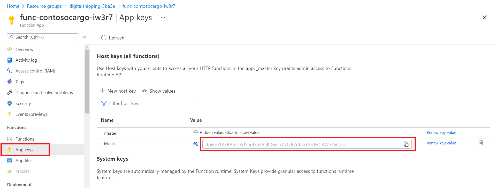
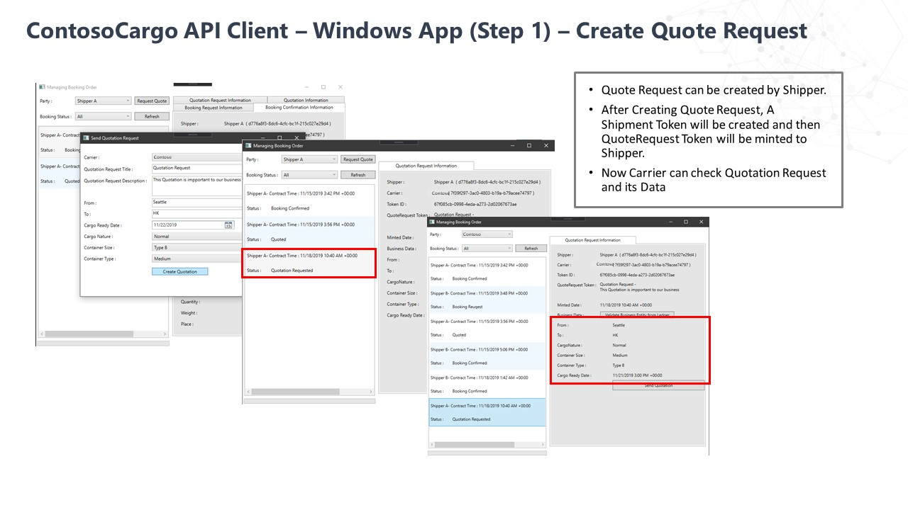
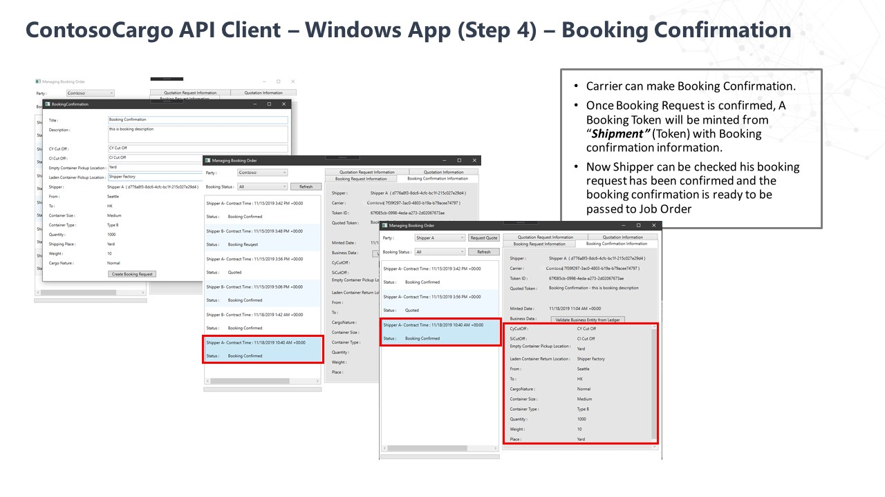

# Windows Client Application

This folder contains documentation on how to run the sample application to demonstrate the digital documentation solution.

 
## Prerequisites
1. Access to an Azure subscription
1. Fundamental knowledge and access to [Visual Studio](https://visualstudio.microsoft.com/)

## How to Run the Console Application in Azure

To run the [source code](../src):

1. Clone/download the [source code](../src) onto your computer and open the folder in Visual Studio.
2. Open the [ContosoCargo.DigitalDocument.TokenService.sln](../src/ContosoCargo.DigitalDocument.TokenService.sln).
3. Navgate to ContosoCargo.DigitalDocument.Setup > appsettings.json
4. Replace the TokenServiceEndpoint and BlockchainNetworkTxNode values which were recevied during setup of the [Azure Non-Fungible Token Solution Accelerator](https://github.com/microsoft/Azure-Non-Fungible-Token-Solution-Accelerator) deployment.
5. Set the ContosoCargo.DigitalDocument.Setup as your start up project and run the solution.
6. Once the application runs successfully, at the end following values will be received.
   - Contoso Cargo Id        : 324ee982-a87d-43c8-affb-07758e732044
   - Shipper A Id            : de5f8ad5-2130-47e3-84f6-4f703b687233
   - Shipper B Id            : 44eef836-0292-4d84-94b3-665c7079011b
   - **Note: Above given value will be different everytime we the run ContosoCargo.DigitalDocument.Setup application.**
7. Copy the values received, as they will be needed for next application. Now stop the application.
8. Navigate to ContosoCargo.DigitalDocument.Application.WindowsClient > App.config.
9. Replace HostKey and ServiceEndpoint with your Azure Functions values
   - When [Azure Functions deploys](../deployments/AzureFunctions/README.md) you can see the HostKey and ServiceEndpoint have been received.  
    
   - If these were not copied after deployment, they can found in the Azure Portal.
   - Copy the ServiceEndpoint from Azure Portal.
       
   - Copy the HostKey from the Azure Portal.
       
   - **Note:** Don't forget **/api** on the end! (e.g. _https://contosocargo.azurewebsites.net/api_)
10. Replace ContosoCargo_Id, ShipperA_Id, and ShipperB_Id which were received while running Setup application.
10. Set the Application.WindowsClient as your start up project and run the solution.

## How to Use the Application

The first time the client app runs it will open up to 'Contoso Cargo' as the Party and there will no quotes. Once there are shipping quotes, the client should look like this:

### 1. Start with a shipper creating a quote request:

### 2. The carrier will respond with a quotation:

### 3. The shipper will book the request:

### 4. The carrier will confirm the request:
